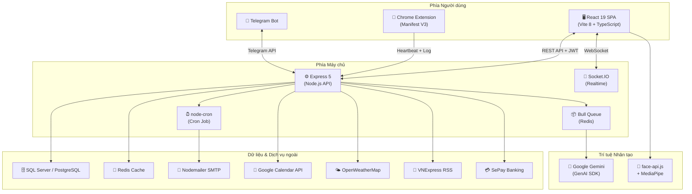
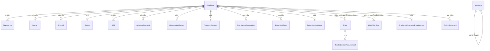
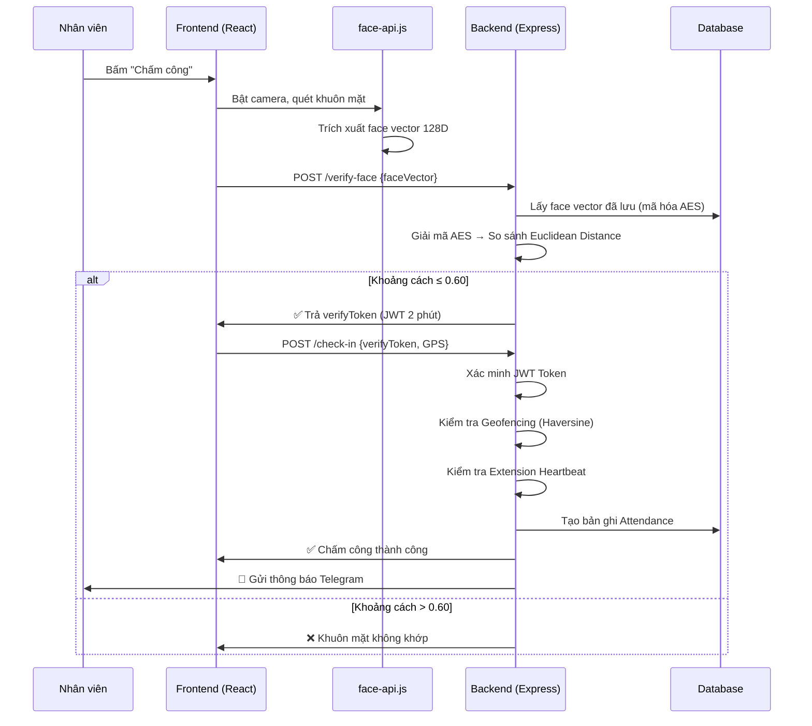
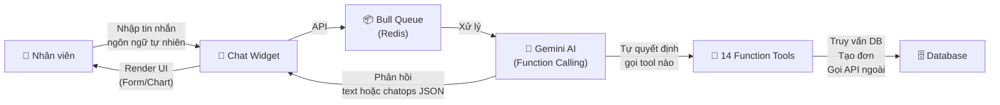
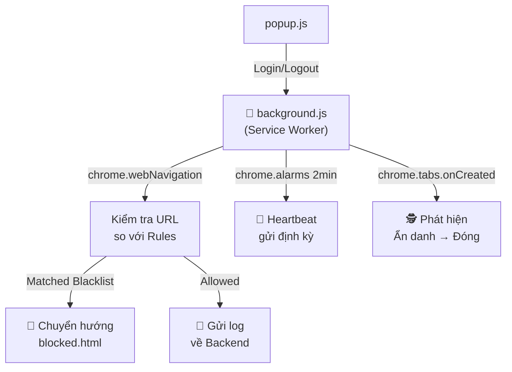

# 📘 TÀI LIỆU DỰ ÁN: HỆ THỐNG QUẢN TRỊ NHÂN SỰ THÔNG MINH (HRMS 4.0)

---

## 📌 Thông tin chung

| Mục | Chi tiết |
|-----|---------|
| **Tên dự án (Tiếng Việt)** | **Hệ thống Quản trị Nhân sự Thông minh tích hợp Trí tuệ Nhân tạo (HRMS 4.0)** |
| **Tên dự án (Tiếng Anh)** | Human Resource Management System 4.0 |
| **Loại ứng dụng** | Ứng dụng Web doanh nghiệp toàn diện (Full-stack Web Application) |
| **Kiến trúc** | Monorepo gồm 3 thành phần: Frontend (SPA) + Backend (REST API) + Chrome Extension |
| **Số module chức năng** | 19 module |
| **Số chức năng con** | ~60 chức năng |
| **Số bảng CSDL** | 27 bảng |
| **Số nhóm API** | 21 nhóm routes |

---

## 🏗️ Kiến trúc tổng quan hệ thống



---

## 🔧 Công nghệ sử dụng chi tiết

### Frontend (Ứng dụng Giao diện)

| Công nghệ | Phiên bản | Vai trò |
|-----------|-----------|---------|
| **React** | 19.2.7 | Thư viện UI chính, xây dựng giao diện SPA (Single Page Application) |
| **Vite** | 8.1.0 | Công cụ build & dev server nhanh, thay thế Webpack |
| **TypeScript** | 6.0.2 | Ngôn ngữ lập trình có kiểm tra kiểu tĩnh (Static Type Checking) |
| **Tailwind CSS** | 3.4.19 | Framework CSS tiện ích (Utility-first CSS) để thiết kế giao diện |
| **Zustand** | 5.0.14 | Quản lý trạng thái toàn cục (Global State Management) — thay thế Redux |
| **TanStack React Query** | 5.101.1 | Quản lý dữ liệu bất đồng bộ từ API (Data Fetching & Caching) |
| **React Router DOM** | 7.18.0 | Điều hướng trang (Routing) trong SPA |
| **Socket.IO Client** | 4.8.3 | Kết nối WebSocket để nhận thông báo thời gian thực |
| **Recharts** | 3.9.2 | Thư viện vẽ biểu đồ (Bar, Line, Pie Chart) trên Dashboard |
| **FullCalendar** | 6.1.21 | Hiển thị lịch sự kiện, hỗ trợ kéo thả (Drag & Drop) |
| **face-api.js** | 0.22.2 | Nhận diện khuôn mặt trên trình duyệt (Client-side Face Recognition) |
| **MediaPipe Tasks Vision** | 1.0.0 | Thư viện AI Vision của Google, hỗ trợ nhận diện khuôn mặt nâng cao |
| **i18next** | 26.3.2 | Hỗ trợ đa ngôn ngữ (Tiếng Việt / Tiếng Anh) |
| **Lucide React** | 1.21.0 | Bộ icon SVG đẹp cho giao diện |
| **React Markdown** | 10.1.0 | Render nội dung Markdown (dùng cho AI chat, chính sách) |
| **React Syntax Highlighter** | 16.1.1 | Highlight code trong khối mã Markdown |
| **jsQR** | 1.4.0 | Quét mã QR trên trình duyệt |
| **clsx + tailwind-merge** | - | Tiện ích gộp class CSS có điều kiện |

### Backend (API Server)

| Công nghệ | Phiên bản | Vai trò |
|-----------|-----------|---------|
| **Node.js** | - | Runtime JavaScript phía server |
| **Express** | 5.2.1 | Framework HTTP/REST API chính |
| **Sequelize ORM** | 6.37.8 | Thao tác CSDL qua đối tượng JavaScript (Object-Relational Mapping) |
| **Tedious** | 19.2.1 | Driver kết nối Microsoft SQL Server |
| **Socket.IO** | 4.8.3 | Server WebSocket cho thông báo thời gian thực |
| **Bull Queue** | 4.16.5 | Hàng đợi tin nhắn (Message Queue) dựa trên Redis |
| **Redis** | 6.1.0 | In-memory cache & message broker cho Bull Queue |
| **@google/genai** | 2.10.0 | SDK chính thức của Google để gọi Gemini AI |
| **jsonwebtoken** | 9.0.3 | Tạo và xác thực JWT Token cho xác thực người dùng |
| **bcryptjs** | 3.0.3 | Mã hóa mật khẩu một chiều (Password Hashing) |
| **svg-captcha** | 1.4.0 | Tạo mã Captcha chống đăng nhập tự động (Brute-force) |
| **Nodemailer** | 9.0.3 | Gửi email qua SMTP |
| **node-cron** | 4.6.0 | Chạy tác vụ định kỳ (Cron Job) |
| **node-telegram-bot-api** | 1.1.2 | SDK tương tác với Telegram Bot API |
| **googleapis** | 173.0.0 | SDK Google APIs (Calendar, OAuth2) |
| **multer** | 2.2.0 | Xử lý upload file (Multipart Form Data) |
| **exceljs** | 4.4.0 | Tạo và xuất file Excel (.xlsx) |
| **rss-parser** | 3.13.0 | Đọc tin tức từ RSS Feed (VNExpress) |
| **axios** | 1.18.1 | HTTP client gọi API bên thứ 3 (Weather, SePay) |
| **lunar-javascript** | 1.7.7 | Chuyển đổi Dương lịch ↔ Âm lịch |
| **cors** | 2.8.6 | Cấu hình Cross-Origin Resource Sharing |

### Chrome Extension (Giám sát Web)

| Công nghệ | Vai trò |
|-----------|---------|
| **Chrome Extension Manifest V3** | Nền tảng extension trình duyệt thế hệ mới |
| **Service Worker (background.js)** | Chạy ngầm, kiểm tra URL, gửi heartbeat |
| **Content Script (content.js)** | Inject vào trang web để thu thập thông tin |
| **chrome.alarms API** | Thay thế setInterval (bắt buộc cho MV3), dùng cho heartbeat & sync rules |
| **chrome.webNavigation API** | Lắng nghe sự kiện điều hướng để chặn/log URL |
| **chrome.storage API** | Lưu trữ thông tin đăng nhập cục bộ |

### Triển khai (DevOps)

| Công nghệ | Vai trò |
|-----------|---------|
| **Docker Compose** | Đóng gói & triển khai 4 service (Frontend Nginx, Backend, PostgreSQL, Redis) |
| **PostgreSQL 15** | CSDL production trong Docker (thay thế SQL Server) |
| **Redis 7** | Cache & Message Broker trong Docker |
| **Nginx** | Reverse proxy phục vụ frontend build |

---

## 📊 Cơ sở dữ liệu — 27 Bảng



### Danh sách 27 bảng dữ liệu:

| # | Tên bảng | Mô tả |
|---|----------|-------|
| 1 | **Employee** | Thông tin nhân viên: họ tên, email, phòng ban, mật khẩu (hash), face vector (mã hóa AES), trạng thái |
| 2 | **Department** | Danh sách phòng ban |
| 3 | **Role** | Vai trò hệ thống: admin, hr_manager, department_manager, employee |
| 4 | **EmployeeRole** | Bảng trung gian quan hệ nhiều-nhiều Employee ↔ Role |
| 5 | **Attendance** | Bản ghi chấm công: ngày, giờ vào/ra, trạng thái (Present/Late/Absent/Half-day) |
| 6 | **AttendanceExplanation** | Đơn giải trình chấm công: loại (Late/Missing_Punch/Leave_Early), lý do, trạng thái duyệt |
| 7 | **Leave** | Đơn nghỉ phép: loại phép (Annual/Sick/Personal), ngày bắt đầu/kết thúc, trạng thái |
| 8 | **Salary** | Cấu hình lương: lương cơ bản, phụ cấp, hệ số OT, thông tin ngân hàng |
| 9 | **Payroll** | Bảng lương tháng: lương gộp, khấu trừ, thuế, ứng lương, thực nhận |
| 10 | **AdvanceRequest** | Đơn ứng lương: số tiền, kỳ lương, trạng thái duyệt |
| 11 | **KPI** | Chỉ tiêu hiệu suất: tên KPI, trọng số, điểm tự đánh giá, điểm manager đánh giá |
| 12 | **OnboardingRecord** | Hồ sơ tiếp nhận nhân viên mới: CMND/CCCD, ngân hàng, hợp đồng |
| 13 | **ScheduledEvent** | Sự kiện hẹn giờ: loại (EMAIL/MEETING/REMINDER/HOLIDAY), payload, trạng thái (PENDING/PROCESSING/COMPLETED/FAILED) |
| 14 | **PolicyDocument** | Tài liệu chính sách: tiêu đề, nội dung Markdown, danh mục, quyền truy cập theo role, lịch phát hành |
| 15 | **Message** | Tin nhắn chat nội bộ: người gửi, người nhận, nội dung, reply (trả lời tin nhắn) |
| 16 | **TelegramAccount** | Liên kết Telegram: chat ID ↔ employee ID |
| 17 | **WebFilterRule** | Quy tắc lọc web: URL pattern (wildcard), loại (blacklist/whitelist), trạng thái |
| 18 | **WebAccessLog** | Nhật ký truy cập web: URL, hành động (allowed/blocked), IP, trình duyệt, HĐH |
| 19 | **RuleExemption** | Bảng trung gian miễn trừ: nhân viên nào được bỏ qua rule nào |
| 20 | **ExtensionHeartbeat** | Trạng thái extension: lastPing, browser, OS, version |
| 21 | **RoleExtensionRequirement** | Yêu cầu cài extension theo vai trò |
| 22 | **EmployeeExtensionRequirement** | Yêu cầu cài extension theo từng nhân viên cụ thể |
| 23 | **DepartmentPermission** | Phân quyền theo phòng ban (RBAC mở rộng) |
| 24 | **EmployeePermission** | Phân quyền theo cá nhân nhân viên (RBAC mở rộng) |
| 25 | **MenuItem** | Cấu hình menu điều hướng: icon, label, route, quyền, thứ tự sắp xếp |
| 26 | **Setting** | Cài đặt hệ thống key-value: GPS văn phòng, bán kính, feature toggle |
| 27 | **Department** | Phòng ban |

---

## 🔐 MODULE 1: Xác thực & Phân quyền

### Chức năng chi tiết:

| Chức năng | Mô tả kỹ thuật |
|-----------|----------------|
| **Đăng nhập (Login)** | Xác thực username/password → so sánh bcrypt hash → tạo JWT Token chứa `{id, role, roles, username}` → Captcha SVG chống brute-force |
| **Đăng ký (Register)** | Tạo tài khoản → mã hóa mật khẩu bằng `bcryptjs` → gán role mặc định `employee` |
| **Đổi mật khẩu có OTP** | Gửi OTP qua Email (Nodemailer) hoặc Telegram Bot → xác minh OTP → cho phép đổi mật khẩu |
| **Phân quyền RBAC** | 4 vai trò: `admin`, `hr_manager`, `department_manager`, `employee` → Middleware kiểm tra JWT + role trước mỗi API |
| **Feature Toggle** | Admin bật/tắt module qua bảng `Setting` → Frontend đọc config trước khi render trang |

### Thuật toán & Kỹ thuật:
- **Bcrypt Hashing**: Mã hóa mật khẩu một chiều với salt rounds, không thể giải mã ngược
- **JWT (JSON Web Token)**: Token chứa payload `{id, role, roles, username}`, có thời hạn (expiry), server không cần lưu session
- **SVG Captcha**: Tạo hình ảnh SVG nhiễu ngẫu nhiên chứa mã xác thực, chống bot tự động đăng nhập

---

## 👤 MODULE 2: Quản lý Nhân sự

### Chức năng chi tiết:

| Chức năng | Mô tả kỹ thuật |
|-----------|----------------|
| **Danh sách nhân viên** | API GET phân trang (pagination), tìm kiếm (search), lọc theo phòng ban/trạng thái |
| **Chi tiết nhân viên** | CRUD thông tin cá nhân, phòng ban, vai trò, trạng thái active/inactive |
| **Quản lý Phòng ban** | CRUD phòng ban, gán/gỡ nhân viên khỏi phòng ban |
| **Quản lý Vai trò (Role)** | CRUD vai trò, gán/gỡ role cho nhân viên bằng bảng trung gian `EmployeeRole` |
| **Hồ sơ cá nhân** | Nhân viên tự xem/cập nhật thông tin, avatar, đổi mật khẩu |
| **Đăng ký Face ID** | Thu thập face vector 128 chiều qua camera → mã hóa AES-256-CBC → lưu vào DB (xác minh OTP trước) |

### Thuật toán — Mã hóa Face Vector:
```
Đăng ký Face ID:
1. Camera trình duyệt → face-api.js trích xuất face descriptor (vector 128 chiều float)
2. Gửi vector lên Backend
3. Backend mã hóa bằng AES-256-CBC:
   - Tạo IV (Initialization Vector) ngẫu nhiên 16 bytes
   - Mã hóa vector thành ciphertext
   - Lưu cả ciphertext + IV vào DB
```

---

## ⏰ MODULE 3: Chấm công (Nhận diện Khuôn mặt + GPS)

> [!IMPORTANT]
> Đây là module phức tạp nhất của hệ thống, kết hợp **3 lớp bảo mật**: Nhận diện khuôn mặt + Geofencing GPS + Kiểm tra Extension.

### Quy trình Check-in 2 bước:



### Thuật toán sử dụng:

#### 1. Nhận diện khuôn mặt — Euclidean Distance (Khoảng cách Euclid)

```javascript
// File: services/faceVectorService.js
// So sánh 2 vector khuôn mặt 128 chiều

distance = √(Σ(v1[i] - v2[i])²)  // i = 0..127

// Ngưỡng (threshold): 0.60
// distance ≤ 0.60 → KHỚP (cùng 1 người)
// distance > 0.60 → KHÔNG KHỚP (khác người)
```

**Giải thích**: face-api.js (dựa trên mô hình deep learning) trích xuất mỗi khuôn mặt thành 1 vector 128 số thực. Hai khuôn mặt giống nhau sẽ có vector "gần" nhau trong không gian 128 chiều. Khoảng cách Euclid đo độ "gần" này.

#### 2. Geofencing — Công thức Haversine

```javascript
// File: utils/geoUtils.js
// Tính khoảng cách (mét) giữa 2 tọa độ GPS trên mặt cầu Trái Đất

a = sin²(Δlat/2) + cos(lat1) × cos(lat2) × sin²(Δlon/2)
c = 2 × atan2(√a, √(1-a))
distance = R × c   // R = 6,371,000 mét (bán kính Trái Đất)

// So sánh: distance ≤ ALLOWED_RADIUS (mặc định 1000m)
```

**Giải thích**: Công thức Haversine tính khoảng cách đường chim bay giữa vị trí GPS nhân viên và tọa độ văn phòng. Nếu vượt bán kính cho phép (có thể cấu hình trong Setting), không cho chấm công.

#### 3. Mã hóa AES-256-CBC

```javascript
// File: services/cryptoService.js
// Mã hóa đối xứng sử dụng:
// - Algorithm: AES-256-CBC
// - Key: 32 bytes từ biến môi trường ENCRYPTION_KEY
// - IV: 16 bytes ngẫu nhiên mỗi lần mã hóa
// Dùng để bảo vệ face vector trong database
```

### Các chức năng phụ trợ:

| Chức năng | Chi tiết |
|-----------|----------|
| **Check-out** | Xác minh khuôn mặt + GPS → ghi giờ ra, tính giờ làm |
| **Xác định trạng thái** | Sau 8:30 sáng → `Late`, trước 8:30 → `Present` |
| **Cảnh báo vi phạm** | Đi trễ ≥ 3 lần / Vắng ≥ 5 lần / Quên checkout ≥ 3 lần trong tháng → Socket.IO + Telegram cảnh báo |
| **Lịch sử chấm công** | Xem theo tháng dạng bảng + Calendar (FullCalendar), merge cả dữ liệu nghỉ phép |
| **Giải trình chấm công** | Tạo đơn giải trình (Late/Missing_Punch/Leave_Early) → Manager duyệt/từ chối |
| **Kiểm tra Extension** | Trước khi cho check-in, kiểm tra heartbeat của Extension (5 phút timeout) |
| **Thông báo Telegram** | Gửi ảnh chụp + thông tin check-in/out qua Telegram Bot |

---

## 🏖️ MODULE 4: Quản lý Nghỉ phép

| Chức năng | Chi tiết |
|-----------|----------|
| **Tạo đơn nghỉ phép** | Chọn loại phép (Annual/Sick/Personal), ngày bắt đầu/kết thúc (hỗ trợ nửa ngày: sáng/chiều), lý do |
| **Duyệt/Từ chối** | Manager xem danh sách đơn Pending, duyệt hoặc từ chối có ghi chú |
| **Tính phép còn lại** | Quỹ phép mặc định 12 ngày/năm, hỗ trợ tính nửa ngày (≤ 4.5h = 0.5 ngày) |
| **Lịch sử nghỉ phép** | Xem, lọc, xuất danh sách nghỉ phép theo trạng thái/thời gian |

### Thuật toán tính ngày nghỉ:
```
Với mỗi đơn phép đã duyệt:
- Nếu cùng ngày (startDate == endDate):
  - Chênh lệch giờ ≤ 4.5h → tính 0.5 ngày (nửa ngày)
  - Chênh lệch giờ > 4.5h → tính 1 ngày
- Nếu khác ngày: tính = (endDate - startDate) + 1 ngày
- Loại bỏ thứ 7, Chủ nhật khỏi số ngày tính
```

---

## 💰 MODULE 5: Tiền lương & Tài chính

### Chức năng chi tiết:

| Chức năng | Chi tiết |
|-----------|----------|
| **Cấu hình bậc lương** | Lương cơ bản, phụ cấp, hệ số OT, thông tin ngân hàng cho từng nhân viên |
| **Tính lương tự động** | Dựa trên chấm công thực tế, nghỉ phép, OT, khấu trừ |
| **Phiếu lương (Payslip)** | Xem phiếu lương chi tiết, xuất Excel (exceljs) |
| **Ứng lương** | Nhân viên tạo đơn ứng, manager duyệt, tự động trừ khi tính lương |
| **Tích hợp SePay** | API giả lập cổng thanh toán ngân hàng |
| **Gửi phiếu lương Email** | Tự động gửi HTML email kèm bảng chi tiết chấm công |

### Thuật toán tính lương:

```
Input: Tháng, Năm, Nhân viên

1. Tính số ngày làm việc tiêu chuẩn (trừ T7, CN)
2. dailyRate = baseSalary / standardWorkingDays
3. hourlyRate = dailyRate / 8

4. Duyệt từng bản ghi chấm công:
   a. Tính giờ làm = checkOut - checkIn
   b. Nếu vắt qua 12h-13h → trừ 1 giờ nghỉ trưa
   c. Phân loại:
      - Chủ nhật → toàn bộ tính OT
      - Thứ 7:
        • Sáng (≤ 4h) → tính giờ thường
        • Chiều → tính OT
      - Ngày thường → tối đa 8h giờ thường

5. overtimePay = totalOTHours × hourlyRate × otMultiplier (mặc định 1.5x)
6. grossSalary = (regularHours + leaveHours) × hourlyRate + overtimePay
7. Khấu trừ:
   - Đi trễ: lateCount × 50,000 VNĐ
   - BHXH: baseSalary × 10.5%
8. Thuế TNCN: taxableIncome × 5%
9. netSalary = grossSalary + phụ cấp - khấu trừ - thuế - ứng lương
```

---

## 📈 MODULE 6: Đánh giá Hiệu suất (KPI)

| Chức năng | Chi tiết |
|-----------|----------|
| **Quản lý chỉ tiêu KPI** | Admin/Manager tạo, chỉnh sửa, gán KPI cho nhân viên theo kỳ đánh giá |
| **Nhân viên tự đánh giá** | Cập nhật tiến độ, tự chấm điểm cho từng KPI |
| **Manager đánh giá** | Manager xem, chấm điểm, comment cho KPI của nhân viên thuộc phòng ban |

---

## 🆕 MODULE 7: Onboarding Nhân viên mới

| Chức năng | Chi tiết |
|-----------|----------|
| **Luồng Onboarding (Wizard)** | Form nhiều bước: Thông tin cá nhân → Tải CMND/CCCD → Thông tin ngân hàng → Ký hợp đồng |
| **AI Onboarding chào đón** | Socket.IO phát hiện nhân viên mới (tạo tài khoản < 24 giờ) → AI gửi tin nhắn chào mừng tự động trong Chatbot |

### Kỹ thuật AI Onboarding:
```javascript
// File: socket.js
// Khi nhân viên kết nối Socket:
const isNew = (Date.now() - employee.createdAt) < 24h;
if (isNew) {
  setTimeout(() => socket.emit('ai_proactive_message', {
    content: "Chào mừng [Tên] gia nhập! Tôi là Trợ lý AI..."
  }), 3000); // Đợi 3 giây
}
```

---

## 🤖 MODULE 8: Trợ lý AI thông minh (AI Chatbot + ChatOps)

> [!IMPORTANT]
> Đây là **điểm nhấn công nghệ cốt lõi** của dự án — sử dụng kỹ thuật **Agentic AI** với **Function Calling** của Google Gemini.

### Kiến trúc AI:



### Mô hình AI sử dụng:
- **Google Gemini** (mặc định model `gemini-2.5-flash`, có thể cấu hình qua `.env`)
- SDK: `@google/genai` (official Google GenAI SDK)

### Cách "Train" AI:
> [!NOTE]
> **KHÔNG huấn luyện (train) model AI từ đầu**. Dự án sử dụng kỹ thuật **Prompt Engineering** + **Function Calling** — tức là:
> 1. Gửi **System Instruction** (Prompt hệ thống) mô tả vai trò, quy tắc, và ngữ cảnh cho Gemini
> 2. Khai báo danh sách **14 Function Tools** với tên, mô tả, và schema tham số
> 3. Gemini tự phân tích câu hỏi người dùng → tự quyết định gọi function nào → Backend thực thi → trả kết quả cho Gemini → Gemini tổng hợp và phản hồi

### System Instruction (Prompt hệ thống):
```
"Bạn là Allambe - trợ lý AI đa năng và quản trị nhân sự (HR) của hệ thống HRMS.
QUAN TRỌNG: Bạn KHÔNG ĐƯỢC PHÉP TỪ CHỐI bất kỳ câu hỏi nào.
Bạn đang trò chuyện với một người dùng có các quyền: [admin/manager/employee].
Thời gian hiện tại: [ISO timestamp]

CÁC QUY TẮC:
1. Nếu phát hiện đi muộn → gợi ý tạo đơn giải trình
2. Muốn xem thời tiết/đọc báo → gọi tool tương ứng
3. Muốn hẹn giờ email → gọi tool schedule_email
4. Manager/Admin có thể hỏi số liệu chung

CHATOPS: Khi xin nghỉ → trả JSON block `chatops` {type: 'leave_request', ...}
         Khi vẽ biểu đồ → trả JSON block `chatops` {type: 'chart', chartData: {...}}
```

### 14 Function Tools (AI có thể tự gọi):

| # | Tên Tool | Mô tả | Quyền |
|---|----------|-------|-------|
| 1 | `get_leave_balance` | Xem số phép còn lại | Tất cả |
| 2 | `get_leave_requests` | Xem danh sách đơn nghỉ phép | Tất cả |
| 3 | `get_salary` | Tra cứu lương tháng cụ thể | Tất cả |
| 4 | `create_leave_request` | Tạo đơn xin nghỉ phép | Tất cả |
| 5 | `get_attendance_today` | Xem giờ vào/ra hôm nay | Tất cả |
| 6 | `get_attendance_late_this_month` | Đếm số lần đi muộn trong tháng | Tất cả |
| 7 | `check_missing_punch` | Kiểm tra quên chấm công ngày cụ thể | Tất cả |
| 8 | `create_attendance_explanation` | Tạo đơn giải trình chấm công | Tất cả |
| 9 | `manager_get_leave_today` | Xem ai đang nghỉ hôm nay | Manager+ |
| 10 | `manager_get_late_this_week` | Liệt kê đi muộn tuần này | Manager+ |
| 11 | `manager_get_total_payroll` | Tổng quỹ lương tháng | Admin |
| 12 | `schedule_email` | Hẹn giờ gửi email tự động | Tất cả |
| 13 | `get_weather` | Xem thời tiết (OpenWeatherMap) | Tất cả |
| 14 | `get_news` | Đọc tin tức VNExpress (RSS) | Tất cả |

### ChatOps Pattern:
AI không chỉ trả text — mà có thể trả **structured JSON** trong khối mã ` ```chatops `:

1. **Leave Request Form**: AI trả `{type: "leave_request", ...}` → Frontend tự render Form xin nghỉ phép bên trong chat
2. **Chart Rendering**: AI trả `{type: "chart", chartData: {chartType: "bar/line/pie", ...}}` → Frontend tự vẽ biểu đồ Recharts trong chat

### AI Queue (Hàng đợi xử lý):
- Sử dụng **Bull Queue** (Redis-backed)
- Mỗi request AI được đẩy vào hàng đợi → Worker xử lý tuần tự
- Kết quả trả về qua **Socket.IO** (web) hoặc **Telegram API** (telegram)
- Tránh quá tải khi nhiều người chat cùng lúc
- Retry tự động khi gặp Rate Limit (429)

### Phân quyền AI:
- AI nhận biết quyền user qua `userRoles` trong JWT
- Employee: chỉ xem dữ liệu cá nhân
- Manager: thêm tools thống kê phòng ban
- Admin: toàn quyền, bao gồm tổng quỹ lương

---

## 🛡️ MODULE 9: Công cụ AI Bảo mật

| Chức năng | Kỹ thuật |
|-----------|----------|
| **Phát hiện tin nhắn lừa đảo (Scam Detector)** | Nhân viên paste tin nhắn nghi ngờ → Gemini AI phân tích → Trả JSON: `{riskLevel, scamType, redFlags[], recommendation, confidence}` |
| **Xác thực giấy tờ (Document Verifier)** | Upload ảnh CMND/Hợp đồng (base64) → Gemini Vision phân tích → Trả JSON: `{documentType, extractedInfo, anomalies[], verdict, confidence}` |

### Cách AI Bảo mật hoạt động:
- **Scam Detector**: Dùng **Prompt Engineering** yêu cầu Gemini đóng vai "chuyên gia bảo mật" → phân tích văn bản → output JSON cố định (`responseMimeType: 'application/json'`)
- **Document Verifier**: Dùng **Gemini Multimodal** (Vision) — gửi cả ảnh + prompt → AI phân tích hình ảnh giấy tờ, nhận diện anomalies

---

## 💬 MODULE 10: Chat Nội bộ Realtime

| Chức năng | Kỹ thuật |
|-----------|----------|
| **Chat 1-1** | Socket.IO realtime, tin nhắn lưu vào bảng `Message`, phân room theo User ID |
| **Trả lời tin nhắn (Reply)** | Model `Message` có trường `replyToId` → self-referencing (tự tham chiếu) |
| **Danh sách liên hệ** | Hiển thị nhân viên online (dựa trên Socket connection), tìm kiếm |
| **Lưu trữ tin nhắn** | Toàn bộ lịch sử chat lưu Database, load khi mở conversation |

---

## 📱 MODULE 11: Telegram Bot

### Kiến trúc:
- Sử dụng `node-telegram-bot-api` với chế độ **Polling** (long-polling)
- Liên kết tài khoản: Nhân viên gõ `/login [username] [password]` → Bot xác thực bcrypt → lưu `chatId ↔ employeeId` vào bảng `TelegramAccount`

### Danh sách lệnh Telegram:

| Lệnh | Chức năng |
|-------|-----------|
| `/start` | Hướng dẫn sử dụng Bot |
| `/login [user] [pass]` | Liên kết tài khoản HRMS |
| `/logout` | Hủy liên kết |
| `/thongtin [MãNV]` | Xem thông tin nhân viên |
| `/luong` | Tra cứu bảng lương tháng hiện tại |
| `/diemdanh` | Xem chấm công hôm nay |
| `/nghiphep` | Tra cứu quỹ phép còn lại |
| `/xinnghi [từ] [đến] [lý do]` | Tạo đơn xin nghỉ phép |
| `/giaitrinh [lý do]` | Giải trình chấm công hôm nay |
| `/hengio [giờ ngày] [email] [đề] \| [nội dung]` | Hẹn giờ gửi email |
| `/thoitiet [thành phố]` | Xem thời tiết (OpenWeatherMap) |
| `/tintuc` | Đọc 10 tin mới nhất VNExpress (RSS) |
| `/lich` | Xem lịch Âm Dương hôm nay (lunar-javascript) |
| **Chat tự do** | Hỏi AI Gemini bất kỳ câu gì (qua Bull Queue) |

### Thông báo Push:
- Khi check-in/check-out thành công → Bot tự động gửi ảnh + thông tin cho nhân viên
- Khi vi phạm chấm công → Bot gửi cảnh báo
- Khi duyệt phép → Bot thông báo kết quả

---

## 📅 MODULE 12: Lịch & Sự kiện

| Chức năng | Kỹ thuật |
|-----------|----------|
| **Lịch sự kiện tương tác** | FullCalendar React, hỗ trợ xem ngày/tuần/tháng, kéo thả sự kiện |
| **CRUD sự kiện** | 4 loại: Meeting, Email, Reminder, Holiday → lưu bảng `ScheduledEvent` |
| **Email hẹn giờ (Cron Job)** | `node-cron` chạy **mỗi phút** → quét bảng `ScheduledEvent` có `status=PENDING` và `scheduledAt ≤ now` → gửi email → cập nhật `COMPLETED/FAILED` |
| **Đồng bộ Google Calendar** | Tích hợp `googleapis` OAuth2 → đồng bộ sự kiện 2 chiều |

### Cron Job chi tiết:
```
Mỗi phút (* * * * *):
1. Quét ScheduledEvent WHERE status='PENDING' AND type='EMAIL' AND scheduledAt ≤ NOW()
2. Cập nhật status → 'PROCESSING' (có lock transaction tránh race condition)
3. Gửi email qua Nodemailer SMTP
4. Cập nhật status → 'COMPLETED' hoặc 'FAILED'
5. Phát Socket.IO notification cho người nhận + người tạo

Đồng thời:
1. Quét PolicyDocument WHERE status='SCHEDULED' AND scheduledPublishAt ≤ NOW()
2. Cập nhật → 'PUBLISHED'
3. Phát Socket.IO thông báo chính sách mới
4. Gửi email thông báo cho nhân viên
```

---

## 📝 MODULE 13: Quản lý Chính sách & Tài liệu

| Chức năng | Kỹ thuật |
|-----------|----------|
| **CRUD Chính sách** | Nội dung Markdown rich-text, hỗ trợ upload file đính kèm |
| **Phân quyền xem** | Trường `targetRoles` (JSON array): `["ALL"]` hoặc `["admin", "hr_manager"]` |
| **Lên lịch phát hành** | `scheduledPublishAt` → Cron tự động chuyển SCHEDULED → PUBLISHED |
| **Thông báo chính sách mới** | Socket.IO broadcast + Email tự động cho nhân viên thuộc `targetRoles` |
| **Hỏi AI về chính sách** | Gửi nội dung chính sách + câu hỏi → Gemini AI đọc hiểu và trả lời |
| **OCR trích xuất văn bản** | Upload ảnh chính sách → Gemini Vision OCR → trích xuất text tiếng Việt |

### AI Hỏi đáp chính sách:
- Gemini nhận System Prompt chứa **toàn bộ nội dung văn bản** chính sách
- AI trả lời chỉ dựa trên tài liệu được cung cấp
- Nếu không có thông tin → hướng dẫn liên hệ người phụ trách

---

## 🔌 MODULE 14: Giám sát Web & Chrome Extension

### Kiến trúc Extension:



| Chức năng | Kỹ thuật |
|-----------|----------|
| **Chặn URL** | Blacklist rules dùng wildcard → convert sang RegExp → so sánh realtime |
| **Log truy cập** | Ghi URL, action (allowed/blocked), IP, browser, OS → bảng `WebAccessLog` |
| **Heartbeat** | chrome.alarms mỗi 2 phút gửi ping → Server biết Extension còn hoạt động |
| **Chặn Ẩn danh** | Lắng nghe `chrome.tabs.onCreated` → nếu `tab.incognito=true` → `chrome.windows.remove()` + log vi phạm |
| **Sync Rules** | chrome.alarms mỗi 5 phút đồng bộ danh sách rules từ Backend |
| **Miễn trừ** | Admin có thể miễn trừ nhân viên cụ thể khỏi 1 rule (bảng `RuleExemption`) |

---

## 📊 MODULE 15: Dashboard & Phân tích

| Chức năng | Kỹ thuật |
|-----------|----------|
| **Admin Dashboard** | Tổng NV, có mặt, đi trễ, nghỉ phép, vắng → Biểu đồ xu hướng 7-30 ngày (Recharts) |
| **Employee Dashboard** | Chấm công hôm nay, phép còn lại, sự kiện sắp tới, thời tiết |
| **Biểu đồ xu hướng** | Line Chart (Recharts) hiển thị trend chấm công |
| **Phân bố phòng ban** | Pie Chart (Recharts) phân bố nhân viên |
| **Widget Thời tiết** | Gọi OpenWeatherMap API realtime |

---

## 🔔 MODULE 16: Thông báo Realtime

| Chức năng | Kỹ thuật |
|-----------|----------|
| **Socket.IO Notification** | Push realtime cho: chấm công, duyệt phép, email, chính sách, cảnh báo bảo mật |
| **Room-based Routing** | Mỗi user join room = User ID (tin cá nhân) + `admin_room` (nếu là admin/manager) |

### Các sự kiện Socket.IO:

| Event | Mô tả |
|-------|-------|
| `ai_response` | AI trả lời tin nhắn |
| `ai_proactive_message` | AI chào đón nhân viên mới |
| `hrms_attendance_warning` | Cảnh báo vi phạm chấm công |
| `new_notification` | Thông báo chung (email, sự kiện) |
| `new_policy_announcement` | Thông báo chính sách mới |
| `new_access_log` | Log truy cập web mới (realtime cho Admin) |
| `extension_status_update` | Cập nhật trạng thái Extension |
| `security_warning` | Cảnh báo bảo mật |
| `explanation_submitted` | Nhân viên nộp giải trình |

---

## 📣 MODULE 17: Bảng tin Xã hội

| Chức năng | Chi tiết |
|-----------|----------|
| **Bảng tin nội bộ (Feed)** | Mạng xã hội nội bộ doanh nghiệp, đăng bài/tin tức công ty |

---

## ⚙️ MODULE 18: Cài đặt Hệ thống

| Chức năng | Chi tiết |
|-----------|----------|
| **Quản lý Menu điều hướng** | Admin tùy chỉnh sidebar: icon (Lucide), label, route, quyền, thứ tự kéo thả |
| **Cài đặt chung** | Feature Toggle, tọa độ GPS văn phòng, bán kính geofencing, chế độ log URL |
| **Dark Mode / Theme** | Chuyển đổi giao diện sáng/tối |
| **Đa ngôn ngữ (i18n)** | Tiếng Việt / Tiếng Anh (i18next + react-i18next) |

---

## 🐳 MODULE 19: Hạ tầng & DevOps

### Docker Compose:

| Service | Image | Port |
|---------|-------|------|
| **frontend** | Nginx (build từ React) | 3000:80 |
| **backend** | Node.js | 3001:3001 |
| **db** | PostgreSQL 15 Alpine | 5432:5432 |
| **redis** | Redis 7 Alpine | 6379:6379 |

| Chức năng | Chi tiết |
|-----------|----------|
| **Upload file** | Multer middleware, giới hạn 10MB, lưu vào `public/uploads/` |
| **Mã hóa dữ liệu** | AES-256-CBC cho face vector, bcrypt cho mật khẩu |
| **Health Check** | `GET /api/health` trả `{status: "OK"}` |

---

## 🧠 Tổng hợp Thuật toán & Kỹ thuật AI

| # | Thuật toán / Kỹ thuật | Nơi sử dụng | Mô tả |
|---|----------------------|-------------|-------|
| 1 | **Euclidean Distance** | Nhận diện khuôn mặt | So sánh 2 vector 128 chiều, ngưỡng 0.60 |
| 2 | **Haversine Formula** | Geofencing GPS | Tính khoảng cách giữa 2 tọa độ trên mặt cầu |
| 3 | **AES-256-CBC** | Mã hóa face vector | Mã hóa đối xứng với IV ngẫu nhiên |
| 4 | **Bcrypt Hashing** | Mã hóa mật khẩu | Hash 1 chiều với salt, không giải mã ngược |
| 5 | **JWT (JSON Web Token)** | Xác thực API | Token chứa payload user, có thời hạn |
| 6 | **Gemini Function Calling** | AI Chatbot | AI tự quyết định gọi function nào dựa trên câu hỏi |
| 7 | **Prompt Engineering** | AI Chatbot, Scam Detector, Document Verifier | Thiết kế prompt chi tiết để AI hiểu vai trò và output format |
| 8 | **Gemini Multimodal Vision** | OCR, Document Verifier | AI xử lý cả text + hình ảnh |
| 9 | **ChatOps Pattern** | AI Chatbot | AI trả structured JSON → Frontend render UI component |
| 10 | **Wildcard → RegExp** | Extension URL Filter | Convert `*facebook.com*` → `.*facebook\.com.*` |
| 11 | **Bull Queue (Redis)** | Xử lý AI | Hàng đợi bất đồng bộ, retry, tránh quá tải |
| 12 | **Cron Job** | Email hẹn giờ, Policy publish | Quét DB mỗi phút, xử lý sự kiện đến hạn |
| 13 | **Room-based WebSocket** | Thông báo Realtime | Phân room theo User ID cho tin nhắn riêng |
| 14 | **Solar ↔ Lunar Conversion** | Telegram Bot | Chuyển đổi Dương lịch ↔ Âm lịch (lunar-javascript) |

---

## 📁 Cấu trúc thư mục dự án

```
hrms4.0/
├── docker-compose.yml          # Cấu hình Docker 4 service
├── PROJECT_OVERVIEW.md          # Tài liệu tổng quan
│
├── hrms-backend/                # === BACKEND (Node.js + Express) ===
│   ├── server.js                # Entry point, khởi tạo Express + Socket + Cron
│   ├── socket.js                # Cấu hình Socket.IO, AI Onboarding
│   ├── sync.js                  # Script đồng bộ DB
│   ├── config/                  # Cấu hình database, redis
│   ├── constants/               # Hằng số (roles)
│   ├── controllers/             # 19 controller (xử lý logic API)
│   │   ├── attendanceController.js    # 813 dòng — module phức tạp nhất
│   │   ├── payrollController.js       # Tính lương tự động
│   │   ├── policyController.js        # Chính sách + AI hỏi đáp + OCR
│   │   └── ...
│   ├── models/                  # 27 Sequelize models (bảng DB)
│   ├── routes/                  # 21 nhóm API routes
│   ├── services/                # Business logic core
│   │   ├── aiService.js              # 558 dòng — AI Gemini + 14 Function Tools
│   │   ├── aiQueueService.js         # Bull Queue cho AI
│   │   ├── telegramBot.js            # 543 dòng — Telegram Bot đầy đủ
│   │   ├── cryptoService.js          # Mã hóa AES-256
│   │   ├── faceVectorService.js      # So sánh face vector (Euclidean)
│   │   └── emailService.js           # Gửi email SMTP
│   ├── middleware/               # JWT auth, role check
│   ├── utils/                   # Tiện ích (geoUtils, leaveUtils)
│   └── public/uploads/          # Thư mục file upload
│
├── hrms-frontend/               # === FRONTEND (React 19 + Vite + TS) ===
│   ├── src/
│   │   ├── features/            # 16 module UI
│   │   │   ├── ai-tools/        # Scam Detector, Document Verifier
│   │   │   ├── attendance/      # Chấm công (camera, face-api)
│   │   │   ├── chat/            # Chat nội bộ + AI Chatbot
│   │   │   ├── dashboard/       # Admin/Employee Dashboard
│   │   │   ├── payroll/         # Bảng lương, phiếu lương
│   │   │   ├── policies/        # Chính sách
│   │   │   ├── security/        # Web Filter, Access Log
│   │   │   └── ...
│   │   ├── components/          # UI components tái sử dụng
│   │   ├── stores/              # Zustand stores (global state)
│   │   ├── services/            # API service layer (axios)
│   │   ├── hooks/               # Custom React hooks
│   │   ├── i18n/                # File ngôn ngữ (vi/en)
│   │   └── utils/               # Tiện ích frontend
│   └── tailwind.config.js       # Cấu hình Tailwind CSS
│
└── hrms-extension/              # === CHROME EXTENSION (Manifest V3) ===
    ├── manifest.json            # Cấu hình extension
    ├── background.js            # Service Worker: filter URL, heartbeat, chặn ẩn danh
    ├── content.js               # Content script inject vào trang
    ├── popup.html/js            # Popup UI đăng nhập extension
    ├── blocked.html             # Trang cảnh báo khi bị chặn
    └── icons/                   # Icon extension
```

---

## 📊 Tổng kết số liệu kỹ thuật

| Chỉ số | Giá trị |
|--------|---------|
| Tổng module chức năng | **19 module** |
| Tổng chức năng con | **~60 chức năng** |
| Tổng bảng CSDL | **27 bảng** |
| Tổng nhóm API Routes | **21 nhóm** |
| Tổng AI Function Tools | **14 tools** |
| Tổng lệnh Telegram Bot | **13 lệnh + chat tự do** |
| Tổng sự kiện Socket.IO | **9+ events** |
| Thuật toán / Kỹ thuật AI | **14 kỹ thuật** |
| Tổng thư viện Backend | **22 thư viện** |
| Tổng thư viện Frontend | **19+ thư viện** |
| Nền tảng tương tác | **3 nền tảng**: Web App + Chrome Extension + Telegram Bot |
